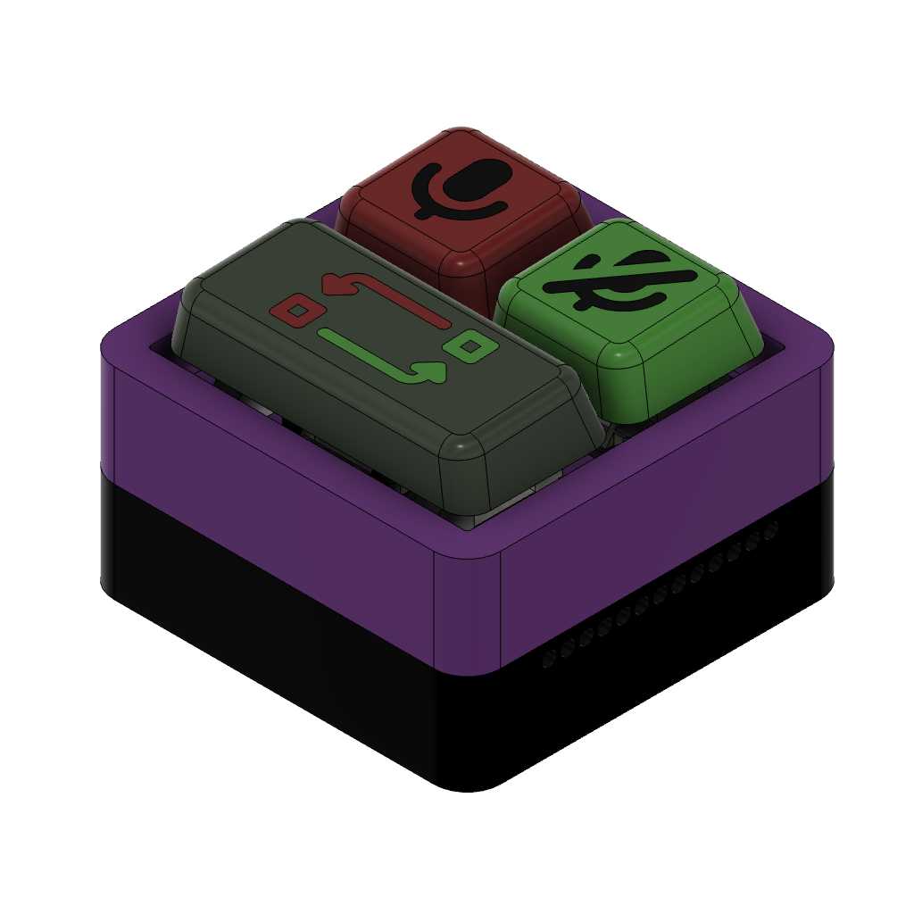
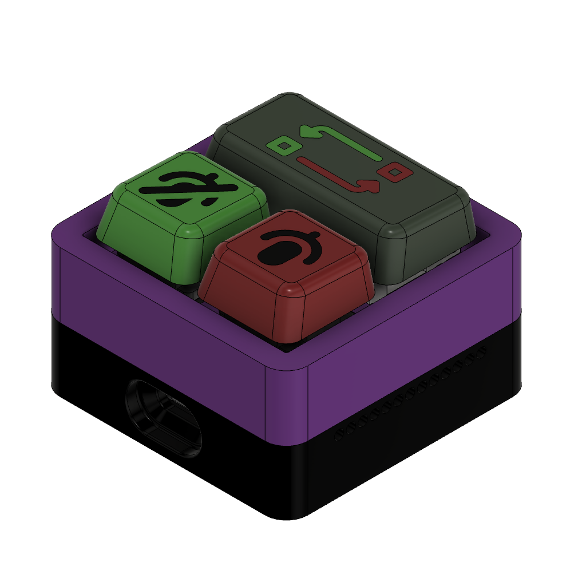
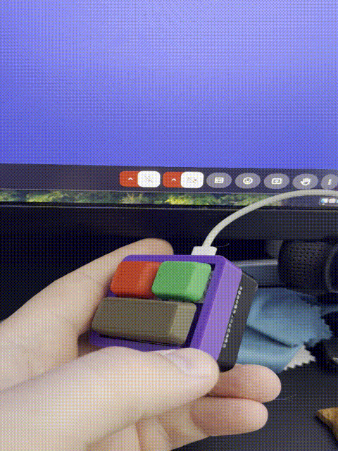
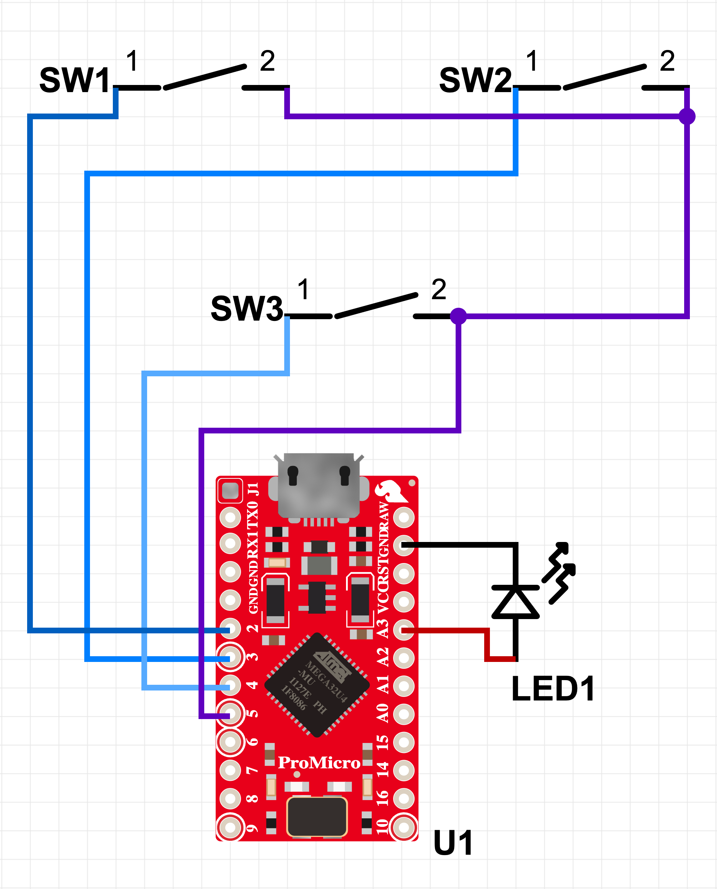

<h1 align="center">Push to talk (or mute😅)</h1>

If you, like me, love to multitask during long meetings in the meets and then are asked a question, you know how it is to find this hacking unmute button in thousands of open tabs!

I got fed up with it and built this HID project. This project is a very simple call-control HID. 

This device can help you mute/unmute yourself in the meets (maybe somewhere else, but I didn't test it) from anywhere. Also, this small device reduces the mental load of finding the mic button with a mouse.

This project has almost all you need: CAD if you want to adjust the project to yourself, STLs/3MFs to print, and source code build for the Arduino Pro Micro.

This project was based on several open-source projects. However, I updated/redesigned 80% of these projects.

---

## Feature

* Call control:
    * Mute
    * Unmute
    * Swap state (ie push-to-talk, push-to-mute)
* Led to show the state
    * Led is on - unmuted
    * Led is off - muted

---

## Preview

  
  

Here, you can see the render. I've played a bit with the design to make it juicy 😁

The project has holes on the sides to put transparent filament so you can see what mode the device is in now, muted or unmuted.

  
  

As you can see, after connecting this call-control HID to Google Meet, you can mute/unmute the call from any place/program when the tab is inactive, even when Chrome is inactive.

---

## What to Print

- Box top 
- Box bottom
- Arduino Pro Micro holder
- Keycaps
    - 1u x2
    - 2u
- Stibilizer x2

---

## What to Buy

Name                    | amount|
--------                |-------|
Key switch              | 3
Khail hotswap           | 3
M3x3x4.2 Bras inserts   | 4
M3 bolt                 | 4  
M3 nuts                 | 2
M3 bolt hidden head     | 2
Steel wire              | ~50mm

---

## Wiring schematic

  

---

## How to use

Here is a great document from Google Meet on [how to add a call control device](https://support.google.com/meet/answer/12562325).

---

## ☕ Buy Me a Coffee

If you found this project helpful, I would appreciate your support!

You can buy me a coffee, which I love, by the way 😅

  

Or you can donate to any of the Ukrainian volunteer foundations!

Слава Україні! Героям Слава!